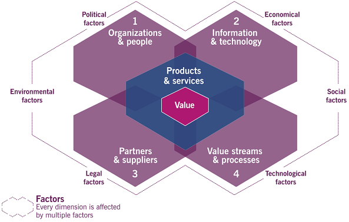

# Lesson 2 - Key Concepts of Service Management

## 2.1 Value and Value Co-Creation

<u>**Value**</u>: The perceived benefits, usefulness, and importance of something.  
<u>**Value co-creation**</u>: When value is created **with** your customers, not **for** your customers. A bi-direction creation instead of a mono-direction.

---

## 2.2 Organizations, Service Providers, Service Consumers, and Other Stakeholders

<u>**Organization**</u>: A person or group with its own internal functions, and with its own set of responsibilities, authorities, and relationships necessary to achieve its objectives.  
<u>**Service Providers**</u>: A provider of service, can be either in the same organization or an outside organization. Most common example ITIL gives is the company's IT department.  
<u>**Service Customers/Consumers**</u>: Generic role/umbrella term for the others below:

- <u>**Customer**</u>: Person who defines the service requirements.
- <u>**User**</u>: Person who uses the service.
- <u>**Sponsor**</u>: Person who authorizes the budget.

---

## 2.3 Products, Services, and Service Relationships

<u>**Service**</u>: A means of enabling value co-creation by facilitating outcomes desireable to customers-without their having to manage cost and risk.

<u>List of organizational resources:</u>

- People
- Information
- Technology
- Value Streams
- Processes
- Suppliers
- Partners

<u>**Service Offering**</u>: A formal description of one or more services. It may include the following below:

- <u>**Goods**</u>: Consumer goods to be supplied, such as a smartphone.
- <u>**Access to resources**</u>: Access under licence to the consumer under agreed-upon terms, such as a mobile network.
- <u>**Service Actions**</u>: Actions to address needs of a particular consumer, such as technical support.

<u>**Service Relationships**</u>: A cooperation with the customer to provide service in order to co-create value. Can include the following:

- <u>**Service Provision**</u>: Activities that provide services such as supplying of goods, ensuring user access, or fulfillment of actions.
- <u>**Service Consumption**</u>: Activities that consume services such as the acquisition of goods, management of resources to use the service, and service actions performed by users.
- <u>**Service Relationship Management**</u>: A combination of the previous two.

---

## 2.4 More About Value, Outcome, Cost and Risk

<u>**Output**</u>: A in/tangible deliverable of an activity.  
<u>**Outcome**</u>: A result, as perceived by a stakeholder, that is enabled by one or more outputs.

An output of a software manufacturer is the code. The outcome might be a satisfied customer who has their needs met.

<u>**Cost**</u>: The amount of money spent on a specific activity/resource.

- <u>**Costs Removed**</u>: Value creation through removal, such as the software provided removes the need for the cost of staff.
- <u>**Costs Imposed**</u>: The cost of the service provided, such as the upfront price, need for staffing or training, and the upkeep cost.

<u>**Risk**</u>: A possible event that could cause harm or loss, or make the achievement of objectives more difficult.

- <u>**Risks Removed**</u>: yada yada...
- <u>**Risks Imposed**</u>: See above...

<u>**Utility**</u>: The functionality offered by a product/service to meet a particular need. Essentially, what the service does.  
<u>**Warranty**</u>: The assurance that a product/service meets agreed-upon requirements. Essentially, how the service performs.

# Lesson 3 - Four Dimensions of Service Management

## 3.1 Organizations and People

<u>**PESTLE analysis**</u>: A framework of external influencing factors represented by the acronym.

- **P**olitical
- **E**conomic
- **S**ocial
- **T**echnological
- **L**egal
- **E**nvironmental

<u>**Organizations and People Dimension**</u>: Includes roles and responsibilities, culture, structure, and staffing(people).

---

## 3.2 Information and Technology

<u>Examples:</u>

- Workflow management systems
- Knowledge bases
- Inventory systems
- Communications systems
- Analytic tools

Note: There is more here, but it's mostly common sense and I'm having a hard time figuring out what to put here without just paraphrasing 3 pages.

---

## 3.3 Partners and Suppliers

Includes the organization's relationships with other organizations. Also includes contracts/agreements between the organization and suppliers.

<u>**Factors that Influence User of Suppliers**</u>:

- <u>**Strategic Focus**</u>: What core competencies of third parties to focus on. (Factors like: self-sufficiency).
- <u>**Corporate Culture**</u>: How the supplier operates internally can be a factor.
- <u>**Resource Scarcity**</u>: If they are the only supplier with a resource, it's your only option.
- <u>**Cost Concerns**</u>: How much do they cost?
- <u>**Subject-Matter Expertise**</u>: How knowledgeable are they about the resource they are providing?
- <u>**External Constraints**</u>: Can include government regulations, industry codes of conduct, or legal constraints.
- <u>**Demand Patterns**</u>: How often will we need to rely on this supplier? Are they okay with that?

---

## 3.4 Value Streams and Processes

This is concerned with how an organization's various parts work and coordinate with each other.

<u>**Value Stream**</u>: A series of steps undertaken to create/deliver products/services.  
<u>**Process**</u>: A set of interrelated activities that transform inputs into outputs. Essentially, what is done to reach an objective.

# Lesson 4 - The ITIL Service Value System

## 4.1 Overview of the Service Value System

<u>Key Inputs:</u>

- <u>**Opportunity**</u>: The possibility to add value.
- <u>**Demand**</u>: The desire for products/services.

<u>Key Outputs:</u>

- <u>**Value**</u>: See previous definition.

<u>5 components in the SVS:</u>

1. <u>**Guiding Principles**</u>: Recommendations for guiding an organization in all circumstances.
2. <u>**Governance**</u>: The way in which the organization is directed/controlled.
3. <u>**Service Value Chain**</u>: Set of interconnected activities an organization performs to deliver product/service.
4. <u>**Practices**</u>: Organizational resources designed for performing work/complete an objective.
5. <u>**Continual Improvement**</u>: Ongoing activity of re-evaluation performed at all organizational levels.

<u>**Organizational Agility**</u>: The ability to move/adapt quickly to support internal changes.

<u>Other important statements:</u>

- The purpose of the SVS is to ensure that the organization continually co-creates value with all stakeholders.
- SVS architecture _enables flexibility_ and _discourages siloed working_.

---

## 4.2 Opportunity, Demand and Value

(be agile...)

---

## 4.3 ITIL Guiding Principles

## <u>**Focus on Value**</u>

<u>**Key Message**</u>: All activities should link back to value for its customers.  
<u>**First step**</u>: Know who your organization is serving.  
<u>Applying the principle:</u>

- Know how consumers use each service.
- Encourage a focus on value among the entire staff.
- Focus on value during normal operations and improvement activities.

## <u>**Start Where you Are**</u>

<u>**Key Message**</u>: You should consider what is already available instead of starting from scratch.  
<u>Applying the principle:</u>

- Observe what exists as objectively as possible.
- Use the desired outcome as a starting point.
- When observing successful practices, figure out how to replicate/expand them.
- Apply risk management skills.
- Remember that sometimes nothing can be reused because it all sucks.

## <u>**Progress Iteratively with Feedback**</u>

<u>**Key Message**</u>: Resist the temptation to do everything at once.  
<u>Applying the principle:</u>

- Comprehend the whole, but doe something.
- The ecosystem is constantly changing, so feedback is essential.
- "Fast" does not mean incomplete.

## <u>**Collaborate and Promote Visibility**</u>

<u>**Key Message**</u>: When initiatives involve the right people in the right roles, efforts benefit (...yada yada).
<u>Applying the principle:</u>

- Collaboration does not mean consensus.
- Communicate in a way the audience can hear.
- Decisions can only be made on visible data.

## <u>**Think and Work Holistically**</u>

<u>**Key Message**</u>: No service/practice/department/supplier stands alone.  
<u>Applying the principle:</u>

- Recognize the complexity of the systems.
- Collaboration is the key to thinking and working holistically.
- Where possible, look for patterns in the needs of an interactions between system elements.
- Automation can facilitate working holistically.

## <u>**Keep It Simple and Practical**</u>

<u>**Key Message**</u>: Always use the minimum number of steps necessary to accomplish an objective.  
<u>Applying the principle:</u>

- Ensure that there's value.
- Simplicity is the ultimate sophistication.
- Do fewer things, but do them better.
- Respect the time of the people involved.
- The easier it is to understand, the more likely it is to be adopted.
- Simplicity is the best route to achieving quick wins.

## <u>**Optimize and Automate**</u>

<u>**Key Message**</u>: Organizations must maximize the value of the work carried out by their resources.  
<u>Applying the principle:</u>

- Simplify/optimize before automating.
- Define your metrics.

---

## 4.4 Governance

An organization is governed by some person or group such as board of directors or executive managers.

<u>3 Activities of Governance:</u>

1. <u>**Evaluation**</u>: Evaluates based on strategy, portfolios and relationships.
2. <u>**Direction**</u>: Governing bodies directs the implementations of an organization.
3. <u>**Monitoring**</u>: Governing bodies monitors the performance, uses data collected to return to step 1.

---

## 4.5 Service Value Chain

<u>6 Activities:</u>

1. Plan
2. Engage
3. Design and Transition
4. Obtain/Build
5. Deliver and Support
6. Improve

Note: There is literally no other explanation of these steps at this point.

---

## 4.6 Continual Improvement

Note: There are 126 words that can be summarized as "Don't Stop Improving".  
Isaac Asimov put it better with his quote "Finished products are for decadent minds."

# Lesson 5 - The Service Value Chain

## 5.1 Introduction to the Service Value Chain

<u>6 Activities:</u>

1. Plan
2. Engage
3. Design and Transition
4. Obtain/Build
5. Deliver and Support
6. Improve

- All of the activities are interconnected.
- The activities convert input into output, which in turn creates value.

---

## 5.2 The Purpose, Inputs, and Outputs of the Value Chain Activities

## <u>**Plan**</u>

Ensures a shared understanding of the vision, current status, and improvement direction for all 4 dimensions of service management.

<u>**Key Inputs**</u>:

- Policies, requirements and constraints provided by the governing body.
- Consolidated demands provided by _Engage_ step.
- Value chain chain performance information, improvement status reports, and improvement initiatives from improve.
- Information about new/changing products/services from _Design and Transition_ and _Obtain/Build_ steps.
- Info about third-party service components from _Engage_ step.

<u>**Key Outputs**</u>:

- Strategic/tactical/operational plans
- Portfolio decisions for _Design and Transition_ step.
- Architectures and policies for _Design and Transition_ step.
- Improvement opportunities for _Improve_ step.
- A product and service portfolio for _Engage_ step.
- Contract and agreement requirements for _Engage_ step.

## <u>**Improve**</u>

Ensures continual improvement of products/services/practices across all activities/dimensions of service management.

<u>**Key Inputs**</u>: (stopping notes on inputs/outputs, because it mostly illustrates how everything is interconnected without detailing what it's actually talking about)

## <u>**Engage**</u>

Provides a good understanding of stake holder needs, transparency, and continual engagement with all stakeholders.

## <u>**Design and Transition**</u>

Ensures that products/services continually meet stakeholder expectations.

## <u>**Obtain/Build**</u>

Ensures that service components are available when they are needed and meet requirements.

## <u>**Deliver and Support**</u>

Ensures that services are delivered and supported. (Wow...)

Note: Now the order of these steps is changed!! Does the order matter?

---

## 5.3 Continual Improvement

<u>Steps of Improvement</u>:

1. <u>**What is the vision?**</u>: Defines the vision of the initiative. Creates a high level vision and communicates it effectively.
2. <u>**Where are we now?**</u>: Assess the current state.
3. <u>**Where do we want to be?**</u>: Defines the desired output.
4. <u>**How do we get there?**</u>: Identifies the actions needed to go from step 2 to step 3.
5. <u>**Take Action**</u>: ...do the thing. (This section goes into using Agile over Waterfall, or other project management styles).
6. <u>**Did we get there?**</u>: Check the destination vs the desired endpoint.
7. <u>**How do we keep the momentum going?**</u>: "Organizational change management and knowledge management practices should be used to embed the changes in the organization and ensure that the improvements and changed behaviors are not at risk of reversion".<--- that is a test answer.

---
