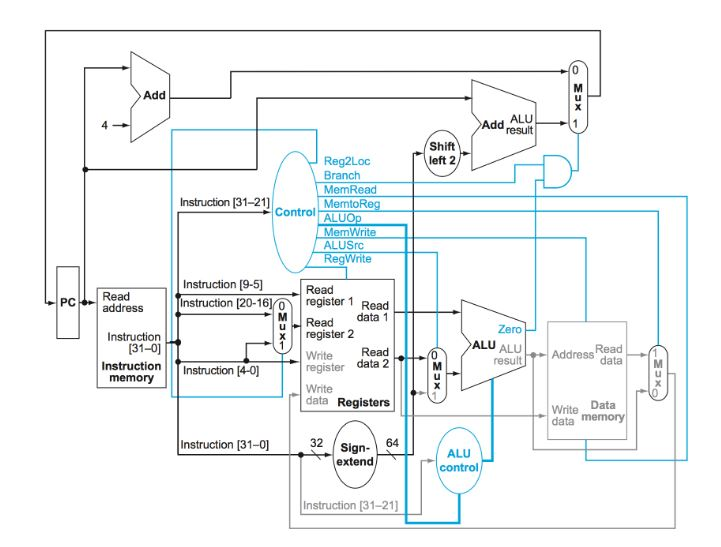

# 5.4 A simple implementation scheme

This diagram is used throughout the section to show the "final" schematic of the LEG processor:  

A single-cycle implementation is uncommon today because a single-cycle implementation.  
This is because a single-cycle implementation, the cycle length must be long enough to support the slowest instruction (probably load).
