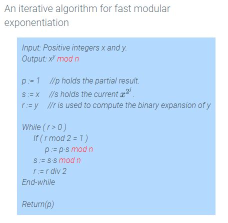

# Module 7 - Fast Exponentiation Algorithms

## 2.18 - Fast Exponentiation

(Fast exponentiation uses successive squaring of values rather than repeated multiplication)

For a number $b$ being raised to exponent $x$ (so $b^x$), instead of multiplying b x times, instead follow these steps:

1. Convert x into binary. (example: $5^7$ becomes $5^{(111)_2}$)
2. For each "1" in that binary number, convert it into form $2^x$, where x is the placement in the number. (example, 7= $2^2$, $2^1$, $2^0$)
3. Raise $b$ to each of those exponents found in step 2. (Example: $5^{2^2} * 5^{2^1} * 5^{2^0}$)

That makes for a faster method to find exponents for large numbers.

---

## 2.19 - Modular Exponentiation

A faster version of the method in section 2.18 exists using modular arithmetic.

