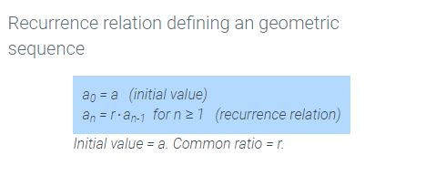

# Module 9 - Recurrence Relations

## 3.3 - Introduction to Recursive Relations

**Recursion** - A method that finds new values using previous values.

When discussing the $n^{th}$ term of a sequence, it's common to write it as $a_n$.  
So the sequence {1,2,3,4,5}, $a_3 = 3$.  
$a_{3+1} = a_4 = 4$

--- 

## 3.4 - Evaluating a Recursive Relation

**Recursive Relation** - A rule that defines a term $a_n$ as a function of the previous terms in a sequence.  

<table>
  <tr>
    <td></td>
    <td></td>
  </tr>
</table>

Some recursive relations can depend on more than 1 previous terms.  A famous example is the *Fibonacci Sequence*.  

**Fibonacci Sequence**  
$f_n = f_{n-1} + f_{n-2}$  
when $f_0 = 0$  
& $f_1 = 1$
