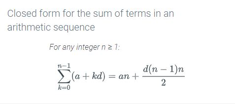

# Module 10 - Induction Methods

## 3.6 - Summations

**Summation notation**  
$\sum_{k=s}^n a_k$  
k = index  
n = upper limit  
s = lower limit

---

## 3.7 - Summation: limits and variables

**Change of variables in summations**

You can substitute the index variable to make summation equations simplified.  
For example: if you have the summation $\sum_{j=1}^{17} 2^{j-1}$, that $j-1$ is pretty ugly.

You can make a new index variable $k$, where $k = j-1$  
From here, substitute the lower limit into $k$ so $k = 1-1 = 0$  
You now should have $\sum_{k=0}$

From here, substitute the upper limit into $k$ so $k = 17-1 = 16$  
You now should have $\sum_{k=0}^{16}$

The equality $k = j-1$ means that $j=k+1$. When we substitute that into $2^{j-1}$ we get $2^{(k+1)-1}$ or $2^k$  
With all this substitution, we now have $\sum_{k=0}^{16} 2^k \equiv \sum_{j=1}^{17} 2^{j-1}$

**Closed forms for sums**

You can rewrite a lot (but not all) of summation equations into normal equations.

<table>
  <tr>
    <td></td>
    <td></td>
  </tr>
</table>

---

## 3.8 - Inductive proof

For a proof by induction, if $Q(n)$ is true, then $Q(n+1)$ is true. Think dominoes: if the base case (first domino knocking over) is true, then the $n^{th}$ domino falling must be true.

---

## 3.9 - Divisibility proof by induction

(Example with division)

---

## 3.10 - Induction proof of a recurrence relation

(Example with recurrence releation)

---

## 3.11 - Induction proof of closed summation

(Example with closed summation)

---

## 3.12 - Strong Induction

---

## 3.13 - Well-ordering principle

**well-ordering principle** - any non-empty subset of non-negative integers has a smallest element.

Mathematical induction $\equiv$ Strong induction $\equiv$ well-ordering principle.  
Prove one, you prove the other two.
