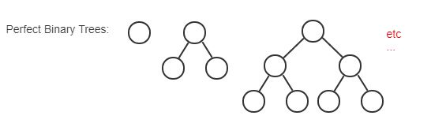

# Module 11 - Recursive Structures

## 3.15 - Overview of recursive definitions

**Recursion** - The process of computing the value of a function using the result of the function on smaller input values.

In other words, it's a funciton that calls itself using a smaller value. It will keep calling itself until it hits a base case.

A famous example is factorials. For a factorial N:

```(javascript)
function factorial (n) {
  return ( n === 0 ? 1 : n * factorial(n-1) );
}

```

---

## 3.16 - Recursively defined sets

Components of a recursively defined set:  
**Basis** - explicitly states that one or more specific elements are in the set.  
**recursive rule** - shows how to construct larger elements in the set from elements already known to be in the set.  
**exclusion statement** - states that an element is in the set only if it is given in the basis or can be constructed by applying the recursive rules repeatedly to elements given in the basis.

An example of this is found in figuring out if nested parenthesis are correct. The **basis** in this example is the sequence () is properly nested. This has two **recursive rules**:

1. (u) is properly nested
2. uv is properly nested

Our **exclusion statement** is: a string is properly nested only if it is given in the basis or can be constructed by applying the recursive rules to strings in the basis.

So using our recursive rules: () is correct, (()) is correct [(u)], and ()() is correct [uv]

---

## 3.17 - Recursive definition for perfect binary trees

1. Start with a single node, this will be our "tree".
2. Copy your existing tree.
3. Place your copied tree along side of your existing tree.
4. Add another node above, making it a parent of both trees.
5. Repeat steps 2-4 as much as you like.



---

## 3.18 - Recursive/inductive algorithms

**Recursive Algorithm** - an algorithm that calls itself.
