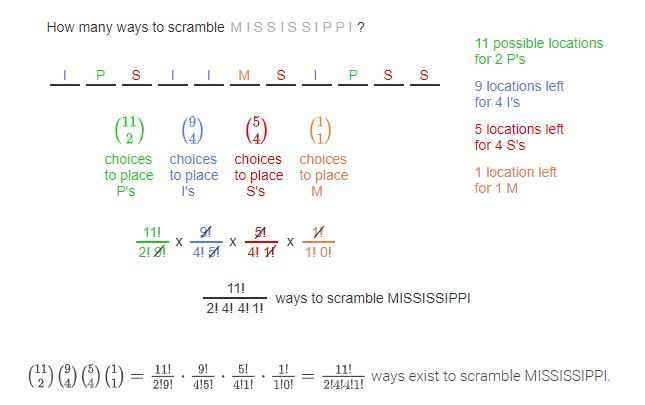

# Module 14 - Counting with Permutations and Combinations

## 4.7 - Counting permutations

Instead of previous counts where the order doesn't matter, permutations means that the order matters.  
**r-permutations** - permutations of length r taken from the same set without repetitions.

The _generalized product rule_ is used here. If you are finding 4-permutations of a set of 10 items, then you have $10 * 9 * 8 * 7$ different possibilities.

**permutation** (without the leading "r-") is a sequence that contains every element of a finite set exactly once.

Formulas:

1. **r-permutation** = $P(n,r) = \frac{n!}{(n-r)!}$  
   A sequence of r items chosen from n total items in which the order of the items matters.
2. **Permutation** = $P(n,n) = n!$  
   A sequence of n items in which the order of the items matters and every item in a set is included exactly once.
3. **r-Subset / r-combination** = $C(n,r) = \binom{n}{r} = \frac{n!}{r!(n-1)!}$  
   A sequence of r items chosen from n total items in which the order of the items does _not_ matter.

---

## 4.8 - Counting subsets

**Combinations (or subsets)** - counting from a group when the order doesn't matters.  
In order to count subsets/combinations, use the 3rd formula from the lesson above.  

In the binomial $\binom{n}{r}$ it's read: "n choose r", or "from the set n, choose r choices for the subset"

**Identity for combinations**  $\binom{n}{n-r} \equiv \binom{n}{r}$  
In other words, "12 choose 8" $\equiv$ "12 choose 4"

---

## 4.9 - Subset and permutation examples

(Just exercises for the above two sections)

---

## 4.10 - Permutations with repetitions

Sometimes in permutations, a value will be repeated and the order will not matter for any repeated outcome.  
For example, the string "Good", and "Good" are different (the two "o"s are swapped) but it doesn't matter since the outcome is the same.  
This is called **permutation with repetition.**

*Useful illustation:*  
