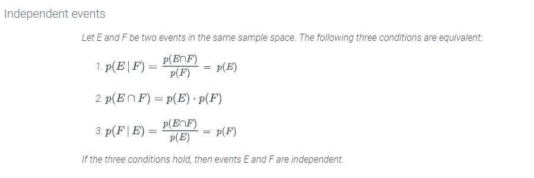
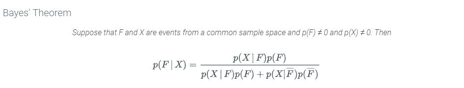

# Module 19 - Conditional Probability and Bayes' Theorem

## 5.8 - Conditional probability

The probability of an event E happening in sample space S is known.  Then an event F happens.  This is how you find out what the likelyhood of E is AFTER F has happened.  

For example: Say you are rolling dice and want to know the likely hood that the total is at least 10 (event E).  That set is {(4,6), (6,4) (5,5), (5,6), (6,5), (6,6)}.  
You roll the first die and it comes up 5 (event F).  Now what is the likelyhood that the total is at least 10?  
Event F is the likleyhood that the roll came up 5, so 1/6.  

To find the **Conditional Probability** of this event, use the following formula:  

$$p(E|F) = \frac{p(E \cap F)}{p(F)}$$

So we know $|E| = 6$ and $|F| = 6$ .  $|E \cap F| = 2$  
$2/6 = 1/3$

---

## 5.9 - Independent vs. dependent events

Two events are **independent** if conditioning on one event does not change the probability of the other event.  
  

---

## 5.10 - Bayes' Theorem

  