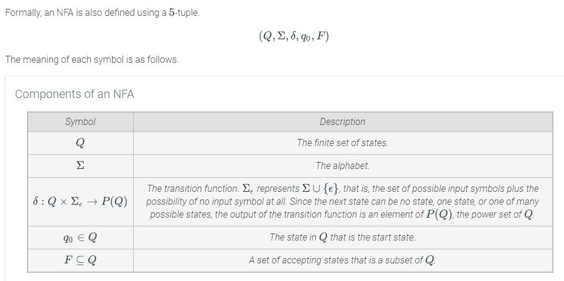

# Module 22 - Nondeterministic Finite State Machine

## 6.10 - Nondeterministic finite automata (NFA)

**Nondeterministic Finite Automata (NFA)** - A finite state automaton whose next state is not uniquely determined by the current state and the next input symbol.  

**Epsilon Transition ($\varepsilon$)** - A transition from one state to another without reading an input.  

---

## 6.11 - NFA state diagrams

The NFA diagram is similar to the DFA, only it resembles more of a tree structure.  

---  

## 6.12 - NFA state transition tables

The diagram found in 6.11 can be represented as a table:  

---

## 6.13 - NFA analyzing transition rules

When analysing inputs, you create a tree of *ALL* possible outcomes.  
Even if there is an input, you must also consider the epsilon transition of each step.  
Also add an epsilon transition at the end of the input (so an input of {1,0} becomes {1,0,$\varepsilon$})

---

## 6.14 - NFA evaluating outcomes

If the machine has an accepting state outcome (indicated by double circles), then it is true (accepting) if the outcome set includes the accepted state.  
Example: If the accepting outcome is {c} and the outcome set is {a,b,c}, then the outcome is acceptable.  

**HOWEVER**, the last part of the input is what determines the output.  See example below:  

