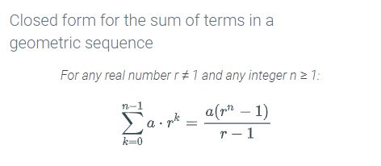
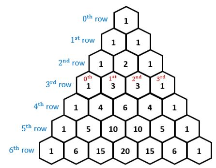

- (1.9) Computational Complexity
  - **Algorithm Complexity** - efficacy of algorithms (Big O) 
  - **Time Complexity** - Time needed to perform algorithm
  - **Space complexity** - Memory needed to perform algorithm

- (1.14) Big-O notation / Asymptotic Growth
  - **Big O** - Upper bound
  - **Big-Omega** - Lower bound
  - **Big-Theta** - Middle
  - Ω(f(n))≤Θ(f(n))≤O(f(n))

-  (2.5) Modular math property of Congruency
   -   $(43^{17} + 32 * 139) \mod 7 \equiv 43 \mod 7 + 32 \mod 7 ∗ 139 \mod 7$

-  (2.8) Greatest Common Divisor(GCD) & Least Common Multiple(LCM)
   - **GCD** - the largest integer that factors into both x & y
   - **LCM** - the smallest integer that is an integer multiple of both x & y

-  (2.10) Euclidean Algorithm for GCD
   -  **SEE EXAMPLE IN SECTION, MEMORIZE ALGORITHM**

-  (2.16) Base b expansion (numbers in other bases)
   -  Digits required to express $n$ in base $b$ = $\log_b (n+1)$

-  (2.18) Fast Exponentiation
   -  $5^7$ becomes $5^{(111)_2}$ becomes $5^{2^2} * 5^{2^1} * 5^{2^0}$

-  (2.23) Crypto terms & RSA Encryption
   -  **SEE EXAMPLE IN SECTION, MEMORIZE ALGORITHM**

-  (3.7) Summation formulas, simplification & use in induction proofs. 
  <table>
    <tr>
     <td></td>
      <td></td>
    </tr>
  </table>

-  (3.13) Well-ordering principle $\equiv$ Strong induction $\equiv$ mathematical induction

-  (3.16) Recursive definition
   -  **(u)** is properly nested  &  **uv** is properly nested
   -  ( () ) is correct - **(u)**
   -  ( )( ) is correct - **uv**
-  (4.7) Permutation formulas 
   1. **r-permutation** = $P(n,r) = \frac{n!}{(n-r)!}$  
   A sequence of r items chosen from n total items in which the order of the items matters.

   2. **Permutation** = $P(n,n) = n!$  
   A sequence of n items in which the order of the items matters and every item in a set is included exactly once.

   3. **r-Subset / r-combination** = $C(n,r) = \binom{n}{r} = \frac{n!}{r!(n-1)!}$  
   A sequence of r items chosen from n total items in which the order of the items does _not_ matter.

-  (4.8) Identity for combinations
   - **Identity for combinations**  $\binom{n}{n-r} \equiv \binom{n}{r}$  
    In other words, "12 choose 8" $\equiv$ "12 choose 4"

-  (4.10) Repeating permutations
   -  **SEE EXAMPLE IN SECTION, MEMORIZE ALGORITHM**
  
-  (4.13) Counting multisets rule
   -  Formula for counting a multiset (collection that can have multiple instances of the same kind of item):  
      $\binom{n+m-1}{m-1} = \frac{(n+m-1)!}{(m-1)!n!}$  
      Where n objects and m varieties (12 cookies, 4 possible flavors) 

-  (4.18) Inclusion-exclusion principle
   -  **2 set** - $|A \cup B| = |A| + |B| - |A \cap B|$
   -  **3 set** - $|A \cup B \cup C| = |A| + |B| + |C| - |A \cap B| - |B \cap C| - |A \cap C| + |A \cap B \cap C|$
  
-  (4.19) Pascal's Triangle  
  
     

-  (5.5) Inclusion-exclusion rule, probability
   -  $$p(E_1 \cup E_2) = p(E_1) + p(E_2) - p(E_1 \cap E_2)$$

-  (5.8) Conditional probablity formula
   -  **SEE NEXT PAGE**

-  (5.9) Independent vs. dependent probability formula
   -  **SEE NEXT PAGE**

-  (5.10) Baye's theorem
   -  **SEE NEXT PAGE**

-  (6.4) Components of DFA  

      

-  (6.10) Components of NFA  
  
      

-  (6.14) NFA outcomes  
  
      