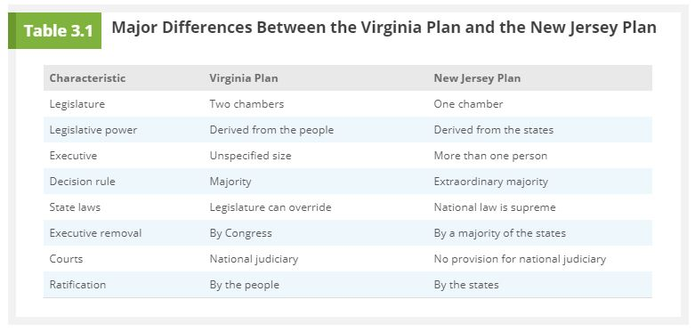

# Chapter 3: The Constitution

## 3.1 - The Revolutionary Roots of the Constitution

<u>**Social Contract Theory**</u>: The belief that the people agree to set up rulers for certain purposes and thus have the right to resist or remove rulers who act against those purposes.

Summary:

- Early US settlers wanted independence from Brittan.
- They viewed themselves independent but needed protection from native Americans and the French in the early days.
- Brittan felt that they should bear the weight of this protection cost and over taxed them.
- US revolted many times and then one big revolt with the boston tea party.
- Once it was too big to ignore, congress met and drafted the Declaration of Independance.
- Not all were on board, loyalists made about 20% of the US. Benjamin Franklin's own son was a loyalist.
- The revolutionary war ensured and was the longest war until the vietnam, and still the war that lost the most American lives.
- Loyalists were kicked out after the war.
- US revolted in the name of liberty.

---

## 3.2 - From Revolution to Confederation

<u>**Republic**</u>: A government without a monarch; a government rooted in the consent of the governed, whose power is exercised by elected representatives responsible to the governed.  
<u>**Confederation**</u>: A loose association of independent states that agree to cooperate on specified matters.  
<u>**Articles of Confederation**</u>: The compact among the thirteen original states that established the first government of the United States.

4 Failings of the Articles of Confederation:

1. **Did not give Federal Government power to tax.**  
   They had to plead with each state for money to continue revolutionary war.
2. **Did not make a provision for independant leadership position.**
3. **Did not give power to regulate interstate & foriegn commerce.**
4. **Could not be ammended without unanomous consent.**  
   This means that each state effectively had veto rights.

---

## 3.3 - From Confederation to Constitution

<u>**Virginia Plan**</u>: A set of proposals for a new government, submitted to the Constitutional Convention of 1787; it included separation of the government into three branches, division of the legislature into two houses, and proportional representation in the legislature.

3 Branches of Government:

1. <u>**Legislative**</u>: Law-making branch.
2. <u>**Executive**</u>: Law-enforcing branch.
3. <u>**Judicial**</u>: Law-interpreting branch.

<u>**New Jersey Plan**</u>: Submitted by the head of the New Jersey delegation to the Constitutional Convention of 1787, a set of nine resolutions that would have, in effect, preserved the Articles of Confederation by amending rather than replacing them.

<u>**Great Compromise**</u>: Submitted by the Connecticut delegation to the Constitutional Convention of 1787, and thus also known as the Connecticut Compromise, a plan calling for a bicameral legislature in which the House of Representatives would be apportioned according to population and the states would be represented equally in the Senate.

<u>**Electoral College**</u>: A body of electors chosen by voters to cast ballots for president and vice president.

---

## 3.4 - The Final Product

### The Basic Principles

<u>**Replublicanism**</u>: A form of government in which power resides in the people and is exercised by their elected representatives.  
<u>**Federalism**</u>: The division of power between a central government and regional governments.  
<u>**Seperation of Powers**</u>: The assignment of lawmaking, law-enforcing, and law-interpreting functions to separate branches of government.  
<u>**Checks and Balances**</u>: A government structure that gives each branch some scrutiny of and control over the other branches.

### The Articles of the Constitution

**1. Legislative Article**

<u>**Enumerated Powers**</u>: The powers explicitly granted to Congress by the Constitution.  
<u>**Necessary and Proper Clause**</u>: The last clause in Section 8 of Article I of the Constitution, which gives Congress the means to execute its enumerated powers. This clause is the basis for Congress's implied powers. Also called the elastic clause.  
<u>**Implied Powers**</u>: Those powers that Congress needs to execute its enumerated powers.

**2. Executive Article**

**3. Judicial Article**

<u>**Judicial Review**</u>: The power to declare congressional (and presidential) acts invalid because they violate the Constitution.

<u>**Supremacy Clause**</u>: The clause in Article VI of the Constitution that asserts that national laws take precedence over state and local laws when they conflict.

---

## 3.5 - Selling the Constitution

<u>**Bill of Rights**</u>: The first ten amendments to the Constitution. They prevent the national government from tampering with fundamental rights and civil liberties, and emphasize the limited character of national power.

---

## 3.6 - Constitutional Change

---

## 3.7 - An Evaluation of the Constitution
